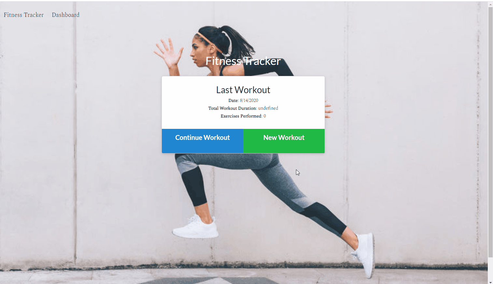

# Fitness Tracker



## Table of Contents

- [Description](#Description)
- [Installation](#installation)
- [Usage](#usage)

## Description

This application uses a Mongo datbase and Express server to create, view, and track daily workouts. The user can create a workout that consists of exercises, reps, and duration of workout.


## Installation

```
npm install
cd seeders
node seed.js
cd ..
node server.js
```

## Usage

You can use this app to create, view, and track workouts. You can add resistance or cardio exercises and can specify things like weight, sets, reps, distance traveled